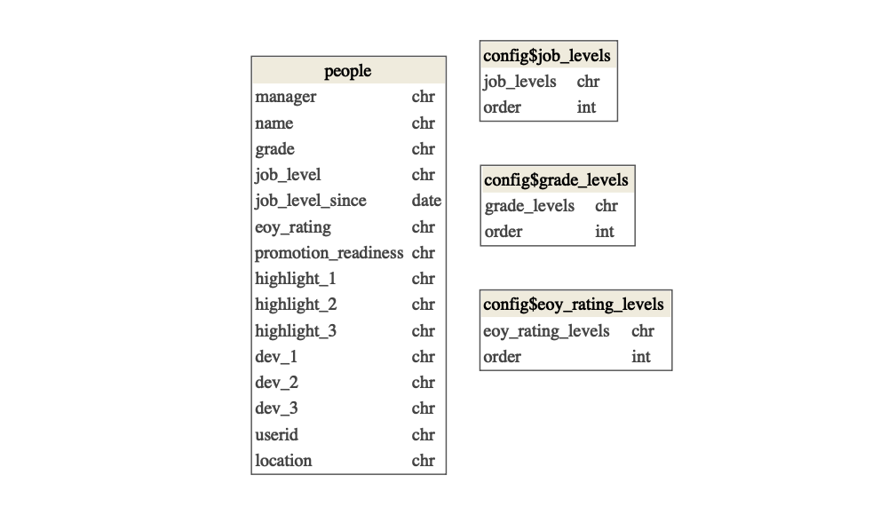

<!-- README.md is generated from README.Rmd. Please edit that file -->

# TalentReview

<!-- badges: start -->

[](https://lifecycle.r-lib.org/articles/stages.html#experimental)
[](https://app.codecov.io/gh/epijim/TalentReview?branch=master)
[](https://github.com/epijim/TalentReview/actions)
<!-- badges: end -->

The goal of TalentReview is to …

## Installation

You can install TalentReview like so:

``` r
remotes::install_github("epijim/TalentFlow")
```

## Setup

### environment variables

The package expects just two environments variables, in addition to the
gsheet behind the env variables. Examples are below:

    TALENTREVIEW_SHEETID = gsheet_id
    TALENTREVIEW_EMAIL = youremail@email.com

### gsheet

This package expects a gsheet to be the input. I’ve put [an example
sheet with fake data
here](https://docs.google.com/spreadsheets/d/1OWA465RghG__aJpFUpQKMyYbsYU57afvpggCWJ10oak/edit?usp=sharing).
By default, each time the app is started it will re-query the gsheet.
The tables and variables in the gsheet are showen below.

``` r
# below is an example bypassing the environment variable
sheet_id <- Sys.getenv("TALENTREVIEW_SHEETID")

## Google sheet
googlesheets4::gs4_auth(cache = "secrets", email = Sys.getenv("TALENTREVIEW_EMAIL"))

config <- TalentReview::read_config(sheet_id)
#> ✓ Reading from "TalentReview".
#> ✓ Range ''lkp_grade_levels''.
#> ✓ Reading from "TalentReview".
#> ✓ Range ''lkp_job_levels''.
#> ✓ Reading from "TalentReview".
#> ✓ Range ''lkp_eoy_levels''.
#> ✓ Reading from "TalentReview".
#> ✓ Range ''lkp_promotion_levels''.
people <- TalentReview::read_people(sheet_id)
#> ✓ Reading from "TalentReview".
#> ✓ Range ''team_data''.

dm::dm(
  people,
  config$grade_levels,
  config$job_levels,
  config$eoy_rating_levels
  ) %>% 
  dm::dm_draw(
    view_type = "all", 
    column_types = TRUE, rankdir = "TB"
    )
```



### running the app

``` r
golem::run_dev()
```

## The app


## Code of Conduct

Please note that the TalentReview project is released with a
[Contributor Code of
Conduct](https://contributor-covenant.org/version/2/0/CODE_OF_CONDUCT.html).
By contributing to this project, you agree to abide by its terms.
